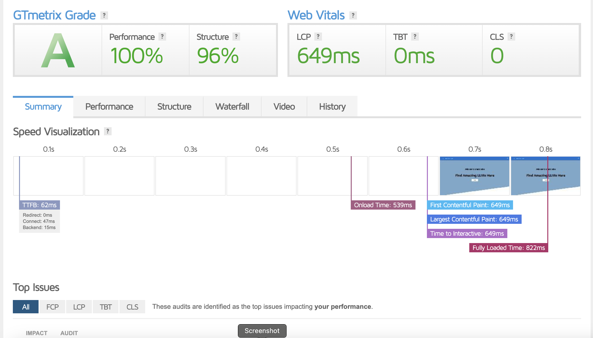

# Online LLM Store

The application gives users the ability to explore, try and create different kinds of LLMs.
**[React](https://reactjs.org/)**, and the **[MUI](https://mui.com/)** are used for developing client-side application. Data is fetched from mock server repository reated in **[Node](https://nodejs.org/)** and deployed on **Render**. The sections below detail the salient features of this project.

## Features

1. **Search Functionality**: Do you want to simultaneously browse different models? Yes, please proceed. You can fetch previous data by resetting filters without re-rendering page because each component retains its own distinct states.
2. **Filters**: Filters in this project are user-selectable criteria, such as the number of reviews, categories, and minimum ratings, used to refine the displayed list of models. These filters enable users to customize their viewing experience by narrowing down the models based on their specific preferences or requirements.
3. **Memoization**: Utilizing useMemo in React allows to memoize the result of computations or operations, such as filtering models based on user-defined criteria. By memoizing the filtered models, we optimize performance by avoiding unnecessary re-renders when the component's dependencies remain unchanged.
4. **Try Out Section**:
The "Try Out" section offers users the opportunity to interact with the created models in real-time, providing a sandbox environment for experimentation. Within this section, users can input sample data or parameters and observe the model's output or behavior. Additionally, users have the ability to copy the model's code directly from the interface, facilitating seamless integration into their own projects or workflows.
5. **Ability to create new models**: The form for creating a new model comprises several essential components. It includes input fields for the model name, description, and code, enabling users to define the model's identity and functionality. Additionally, users can select the model's category from a dropdown menu, aiding in organization and classification. Furthermore, the form features an image upload functionality, allowing users to associate a visual representation with the model. Together, these components provide users with a comprehensive interface to input and customize details for the creation of a new model, enhancing usability and flexibility.

## Performance Audit
- **[PageSpeed Insights](https://pagespeed.web.dev/)**: The site also scores **95 points in Accessibility** and **96 points in Best Practices**. The exact metrics are:
  - **First Contentful Paint**: `0.7s`
  - **Last Contentful Paint**: `1.1s`
  - **Speed Index**: `1.2s`
  - **Cumulative Layout Shift**: `1ms`

- **[GTmetrix](https://gtmetrix.com/)**: The fully loaded time is **0.65 seconds**, with the performance rating of **100%** and structure rating of **96%**. The site receives an A grade too.

  
  

## Optimisations
- **Use of Redux Store**: Redux optimizes performance by minimizing unnecessary re-renders through its efficient state management and selective component updates. This prevents wasteful rendering cycles, leading to faster rendering and improved application responsiveness.
- **Active use of the `useMemo` hook**: The 'useMemo' hook optimizes performance by memoizing the results of computations with the same dependencies, reducing unnecessary re-computations. In the case of tables, the data is fully 'memoized', enhancing efficiency.
- **Streamlined API call management**: Through judicious use of the actions and reducers, the project has successfully curtailed the number of API calls.

## Addtional Optimization Practices
- **Intelligent use of the MUI library:** Let's suppose we want to import a `Alert` component. There are two ways to do that:
  - `import { Alert } from "@mui/material";`
  - `import Alert from "@mui/material/Alert";`   
The former imports the entire library before extracting the Alert component, whereas the latter, a more optimized approach, directly imports only the Alert component, significantly enhancing load times – the method adopted in this project.
- **Minimizing state changes for optimal performance**: Despite a slight reduction in the feature set, the project has excelled in load time due to a conscious effort to minimize the number of state changes during re-renders.
- **Hosted on Vercel**: The website is hosted on Vercel, renowned for being among the swiftest free hosting platforms for JavaScript-based web apps. This is attributed to its efficient CDN and caching features. Additionally, Vercel offers complimentary SSL during hosting, enhancing both page security and potential search engine ranking.

## How to run locally?

In the project directory, you can run:

### `yarn start`

Runs the app in the development mode.\
Open [http://localhost:3000](http://localhost:3000) to view it in the browser.

The page will reload if you make edits.\
You will also see any lint errors in the console.

### `yarn build`

Builds the app for production to the `build` folder.\
It correctly bundles React in production mode and optimizes the build for the best performance.

The build is minified and the filenames include the hashes.\
Your app is ready to be deployed!

See the section about [deployment](https://facebook.github.io/create-react-app/docs/deployment) for more information.
